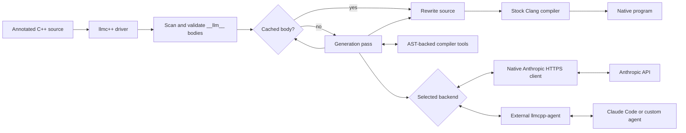

# How `__llm__` compilation works

`__llm__` may annotate a function, method, or lambda definition. Its body is a
natural-language implementation request rather than C++.

For each annotated body, `llmc++`:

1. Creates a length-preserving parsing view in which the prompt body is blank.
2. Parses the translation unit with Clang and validates the annotation.
3. Reuses a cached implementation when one exists, or selects the native
   Anthropic client or an external agent.
4. Lets the model query compiler context through tools such as `get_task`,
   `lookup`, `list_members`, and `try_compile`.
5. Replaces the prompt with the accepted C++ body and invokes Clang normally.

The model receives AST-derived tool results rather than the complete source
file. Candidate bodies are compiled against a rewritten copy before acceptance.
The native Anthropic path invokes the in-process tools directly. External agents
use the same tools through JSON-RPC/MCP.

## Current prototype limits

- `__llm__` is supported on functions, methods, and lambdas only.
- Annotated definitions must be in the main source file. An annotation in an
  included header is rejected.
- Functions and lambdas may return values, including through a deduced `auto`
  return type. Constructors and destructors remain supported.
- An empty prompt still invokes the agent, which infers behavior from the
  declaration and compiler context.
- Line and block comments inside an annotated body are excluded from the prompt.
- The cache key includes the target name, signature, and prompt, but not a full
  context fingerprint.
