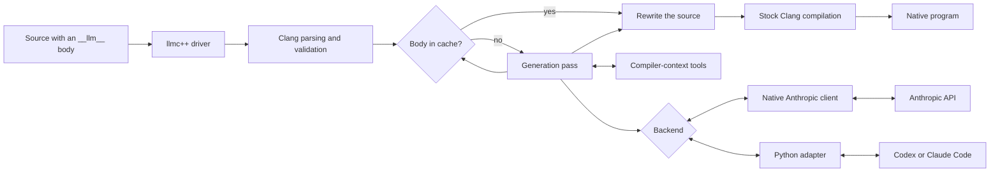

# How LLM compilation works

An `__llm__` body starts as a request written in plain language and ends as an
ordinary C++ body. Generation happens while you compile, not while the finished
program runs.

For each annotated function, method, or lambda, `llmc++`:

1. Replaces the prompt with spaces in a length-preserving parsing view.
2. Parses the translation unit with Clang and validates where `__llm__` appears.
3. Loads a matching cached body or asks the selected backend to generate one.
4. Lets the model inspect declarations and test candidates through compiler
   tools such as `get_task`, `lookup`, `list_members`, and `try_compile`.
5. Accepts a body through `submit`, rewrites the source, and invokes Clang as
   usual.

The backend does not receive the complete source file. It starts with the
function task and asks for the AST-derived context it needs. `try_compile`
checks a candidate in a rewritten copy of the same translation unit before
`submit` accepts it.

The native Anthropic backend calls these tools in process. Codex, Claude Code,
and custom agents reach the same tools through JSON-RPC and MCP, so backend
selection does not change what the compiler can expose.

## Prototype limits

- `__llm__` applies to function, method, and lambda definitions in the main
  source file. An annotation in an included header is rejected.
- Return values, deduced `auto` return types, constructors, and destructors are
  supported.
- An empty prompt still invokes generation. The backend infers conventional
  behavior from the declaration and the available compiler context.
- Comments inside the body are ignored and do not become part of the prompt.
- A template gets one generated body, not a separate body for every
  instantiation.
- The cache key includes the target name, signature, and prompt, but it is not a
  complete fingerprint of every declaration the generated body may use.
- Successful compilation proves that the generated body is valid C++. It does
  not prove that the body matches your intent, so generated code still needs
  review and tests.
