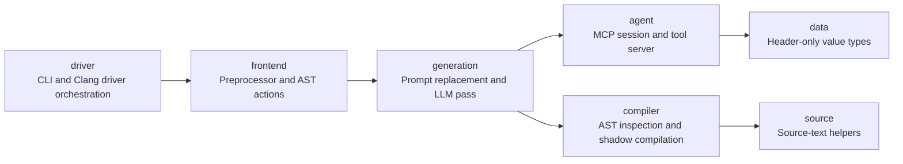

# How the source is structured

| Path | Purpose |
| --- | --- |
| `src/main.cpp` | Executable entry point. |
| `src/llmcpp/driver/` | Command-line handling and Clang driver orchestration. |
| `src/llmcpp/frontend/` | Keyword detection, preprocessing callbacks, and AST actions. |
| `src/llmcpp/generation/` | Annotation validation, caching, prompt generation, and rewriting. |
| `src/llmcpp/agent/` | Native Anthropic client, external-agent session, MCP protocol, and compiler tools. |
| `src/llmcpp/compiler/` | AST extraction, type inspection, and candidate shadow compilation. |
| `src/llmcpp/source/` | Source-text utilities. |
| `include/llmcpp/` | Public declarations mirroring the implementation subnamespaces. |
| `include/llmcpp/data/` | Header-only data types in `llmcpp::data`. |
| `agent/` | The optional Python adapter for Claude Code and external Anthropic use. |
| `test/` | Catch2 integration tests, test cases, and a deterministic mock agent. |
