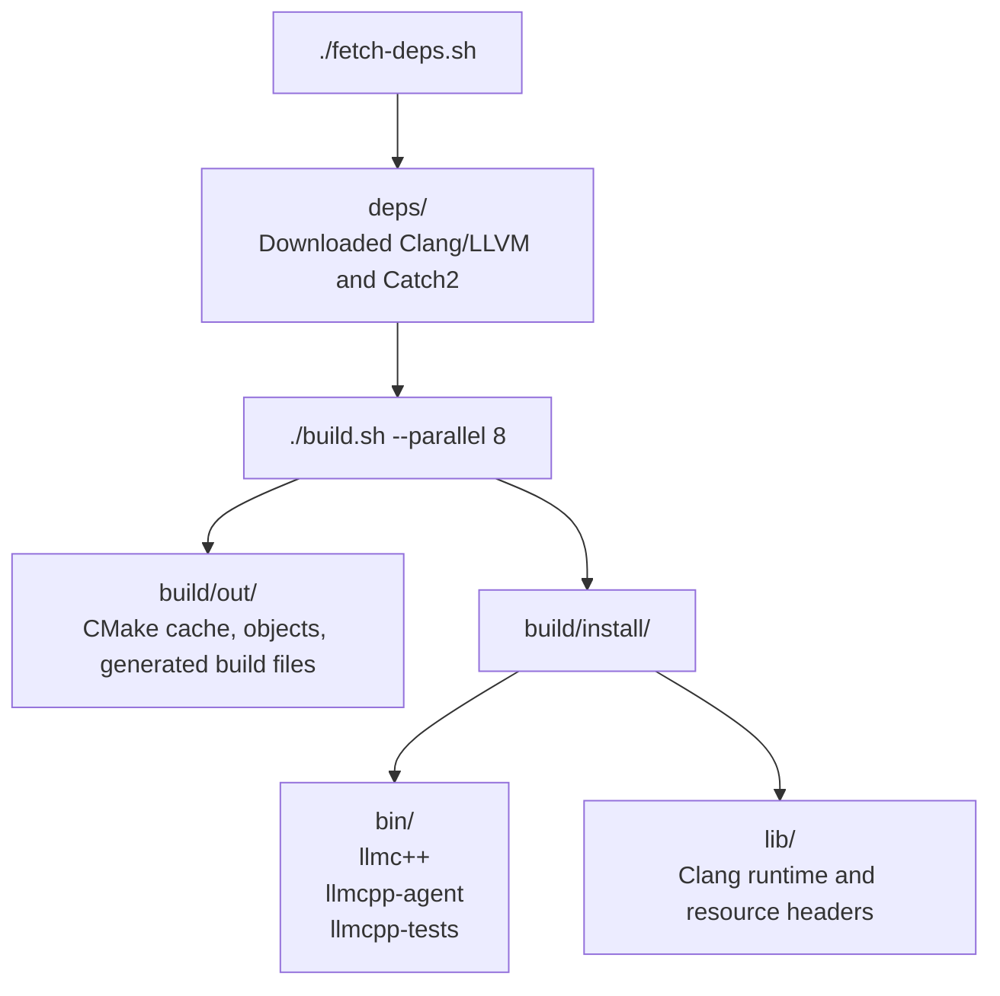

# How to build, test, and clean

## Requirements

- Debian or Ubuntu on x86-64
- CMake 3.20 or newer and a C++17 compiler
- A CMake build backend such as Make or Ninja
- `python3`, `apt-get`, `dpkg-deb`, and either `curl` or `wget`
- An LLM backend: an Anthropic API key or Claude Code

Root access is not required. `fetch-deps.sh` downloads and extracts Clang/LLVM
19 and Catch2 into the project-local `deps/` directory.

## Commands

```sh
./fetch-deps.sh
./build.sh --parallel 8
./test.sh
```

| Command | Effect |
| --- | --- |
| `./fetch-deps.sh` | Download or reuse third-party dependencies in `deps/`. |
| `./build.sh --parallel 8` | Configure, build, and install to `build/install/`. |
| `./test.sh` | Run the registered Catch2 tests with CTest. |
| `./clean.sh` | Delete all build output, including the install bundle. |
| `./clean-deps.sh` | Delete downloaded dependencies. |

## Output layout



`deps/` and `build/` are ignored by Git. The installed agent sits next to
`llmc++` because that is where the driver looks for it. The `lib/` directory
contains the Clang runtime and resource headers used by the installed driver.
